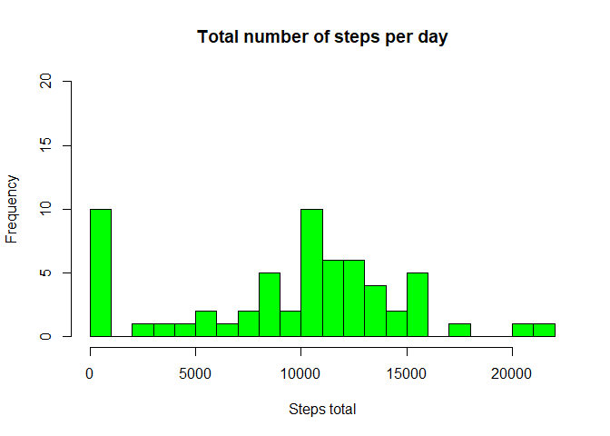

## Introduction  
  
It is now possible to collect a large amount of data about personal movement using activity monitoring devices such as a Fitbit, Nike Fuelband or Jawbone Up. These types of devices are part of the “quantified self” movement – a group of enthusiasts who take measurements about themselves regularly to improve their health, to find patterns in their behavior or because they are tech geeks.  

In this assignment, the following questions shall be answered:  
- What is mean total number of steps taken per day?  
- What is the average daily activity pattern?  
- Are there differences in activity patterns between weekdays and weekends?  
  
## Data  
  
In this assignment data from a personal activity monitoring device are used:  
**URL**: [https://d396qusza40orc.cloudfront.net/repdata%2Fdata%2Factivity.zip](https://d396qusza40orc.cloudfront.net/repdata%2Fdata%2Factivity.zip)  
**Accessing time**: 07-Feb-2021, 11.48 am CET  
  
This device collects data at 5 minutes intervals throughout the day. The data consists of two months of data from an anonymous individual collected during the months of October and November in 2012 and includes the number of steps taken in 5 minutes intervals each day. The data set is stored in a comma-separated-value (CSV) file and comprises a total of 17,568 observations.  
  
The variables included in this dataset are:  
- **steps**: Number of steps taken in a 5-minute interval (missing values are coded as \color{red}{\verb|NA|}NA)  
- **date**: The date on which the measurement was taken in YYYY-MM-DD format  
- **interval**: Identifier for the 5-minute interval in which measurement was taken  

## Part 1: Load packages and data
 

```r
library(plyr)
```

```
## Warning: package 'plyr' was built under R version 4.0.3
```

```r
library(lattice)
activity = read.csv(file="activity.csv")
str(activity)
```

```
## 'data.frame':	17568 obs. of  3 variables:
##  $ steps   : int  NA NA NA NA NA NA NA NA NA NA ...
##  $ date    : chr  "2012-10-01" "2012-10-01" "2012-10-01" "2012-10-01" ...
##  $ interval: int  0 5 10 15 20 25 30 35 40 45 ...
```
  
## Part 2: What is the mean total number of steps taken per day?  

Calculate the total number of steps taken per day (missing values are removed)    

```r
activity.pd = ddply(activity,.(date),summarize,stepsTotal=sum(steps,na.rm=TRUE))
```

Make a histogram of the total number of steps taken each day

```r
hist(activity.pd$stepsTotal, col="green", breaks=seq(from=0,to=22000,by=1000), main="Total number of steps per day", xlab="Steps total",ylim=c(0,20))
```

<!-- -->

Calculate and report the mean and median of the total number of steps taken per day

```r
mean(activity.pd$stepsTotal, na.rm=TRUE)
```

```
## [1] 9354.23
```

```r
median(activity.pd$stepsTotal, na.rm=TRUE)
```

```
## [1] 10395
```

## Part 3: What is the average daily activity pattern?  

Calculate the average number of steps taken per interval (missing values removed), averaged across all days.  
Make a time series plot (i.e. \color{red}{\verb|type = "l"|}type = "l") of the 5-minute interval (x-axis) and the average number of steps taken, averaged across all days (y-axis).  


```r
activity.pi = ddply(activity,.(interval),summarize,stepsMean = mean(steps,na.rm=TRUE))
plot(activity.pi$interval,activity.pi$stepsMean, type="l", main="average steps per time interval across all days",xlab="interval",ylab="Average steps")
```

<!-- -->

Which 5-minute interval, on average across all the days in the data set, contains the maximum number of steps?  

```r
activity.pi$interval[which.max(activity.pi$stepsMean)]
```

```
## [1] 835
```
  
## Part 4: Imputing missing values  

There are a number of days/intervals with missing values (coded as \color{red}{\verb|NA|}NA).   
The presence of missing days may introduce bias into some calculations or summaries of the data.  
Calculate and report the total number of missing values in the data set (i.e. the total number of rows with \color{red}{\verb|NA|}NAs)  

```r
missVal = which(is.na(activity$steps))
length(missVal)
```

```
## [1] 2304
```

Devise a strategy for filling in all of the missing values in the data set. Here we will use the mean for the corresponding 5-minute interval 

```r
days = length(unique(activity$date)) # number of days
stepsMeanPi = rep(activity.pi$stepsMean,days) # vector of same length as the row number of the data frame, repeating the mean interval values for each day
stepsImputed = activity$steps
stepsImputed[missVal] = stepsMeanPi[missVal]
activityImp = mutate(activity, steps=stepsImputed)
```

Make a histogram of the total number of steps taken each day.  
Calculate and report the mean and median total number of steps taken per day.   
Do these values differ from the estimates from the first part of the assignment?  
What is the impact of imputing missing data on the estimates of the total daily number of steps?  

```r
activityImp.pd = ddply(activityImp,.(date),summarize,stepsTotal=sum(steps,na.rm=TRUE))
hist(activityImp.pd$stepsTot, col="lightblue", breaks=seq(from=0,to=22000,by=1000), main="Total number of steps per day after imputing of missing values",xlab="Steps total",ylim=c(0,20))
```

<!-- -->

```r
mean(activityImp.pd$stepsTotal)
```

```
## [1] 10766.19
```

```r
median(activityImp.pd$stepsTotal)
```

```
## [1] 10766.19
```
**Results:** Imputing results in decreased number of zero values and increased number of values in the median range (between 10,000 and 11,000 steps). Both mean and median are higher when missing values are imputed.  

## Part 5: Are there differences in activity patterns between weekdays and weekends?  

Create a new factor variable in the data set with two levels – “weekday” and “weekend” indicating whether a given date is a weekday or weekend day:  
- Change time locale to English (if not already in English)
- Add day variable
- Determine day type (weekday or weekend)  
- Add weekday factor to data set with imputed values  

```r
Sys.setlocale("LC_TIME","English")
```

```
## [1] "English_United States.1252"
```

```r
activityImp = mutate(activityImp, day = weekdays(as.Date(activityImp$date)))
dayType = rep("weekday",nrow(activityImp))
dayType[which(activityImp$day %in% c("Saturday","Sunday"))] = "weekend"
activityImp$dayType = as.factor(dayType)
```

Make a panel plot containing a time series plot (i.e. \color{red}{\verb|type = "l"|}type = "l") of the 5-minute interval (x-axis) and the average number of steps taken, averaged across all weekday days or weekend days (y-axis).  

```r
activityImp.dt = ddply(activityImp,.(interval,dayType),summarize,stepsMean = mean(steps))
xyplot(stepsMean~interval | dayType, data=activityImp.dt, layout = c(1,2), type="l")
```

<!-- -->
  
**Result:** On weekdays more steps are taken early in the morning, but less steps during the day, compared to weekends.    
